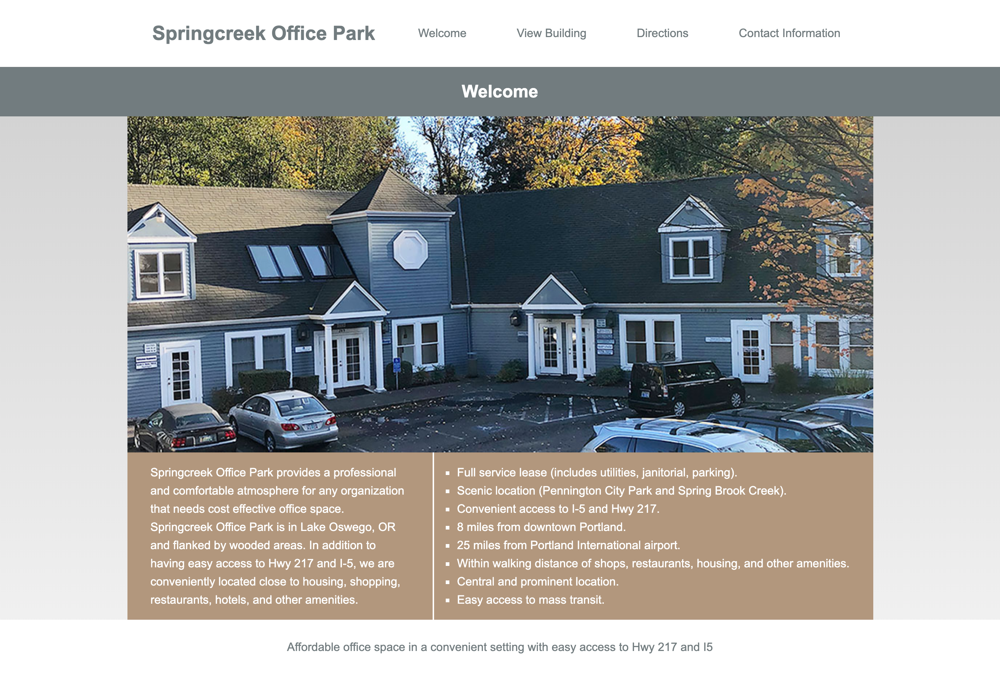
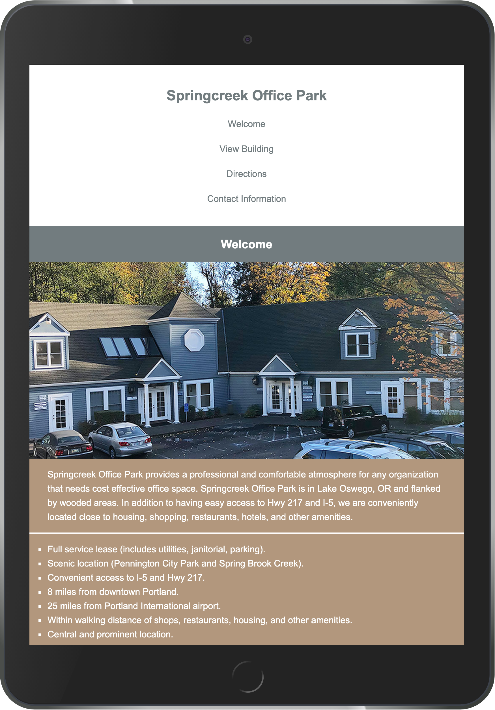
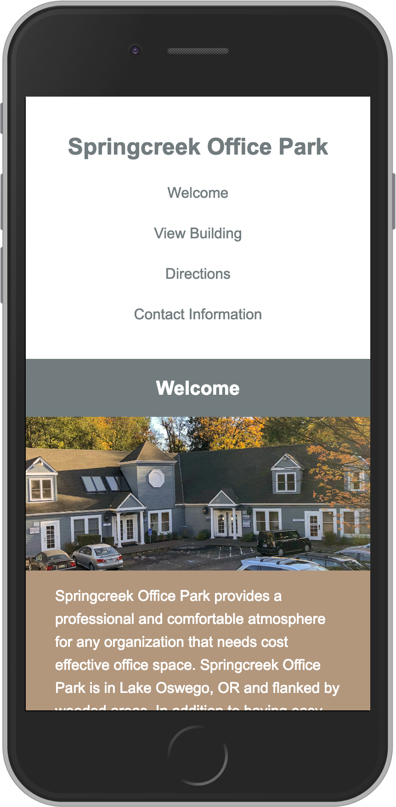

# Springcreek-Office-Park

## Project Overview

A responsive website layout design conceptualized to showcase the Springcreek Office Park building in Lake Oswego, Oregon. Designed around the Flexible Box Module or simply known as Flexbox it provides an ideal interface between today’s PCs, mobile devices and a more efficient way to layout, align, and distribute screen elements.  A user can transition between different viewport sizes while still accessing the same website such as going from Desktop, Tablet to Smartphone all while viewing the same content.  The Springcreek Office Park website can be viewed not only in a Desktop viewport but also Tablet and Smartphone viewports as well.

## Screenshots

Desktop View

Tablet View 

Smart Phone View

